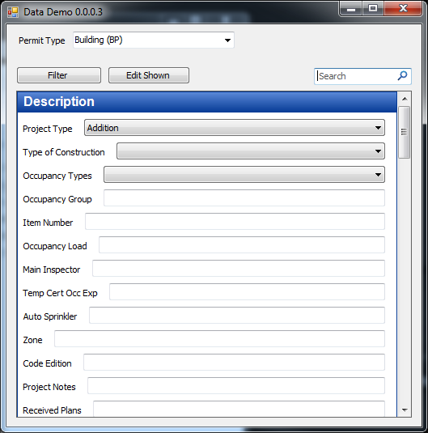
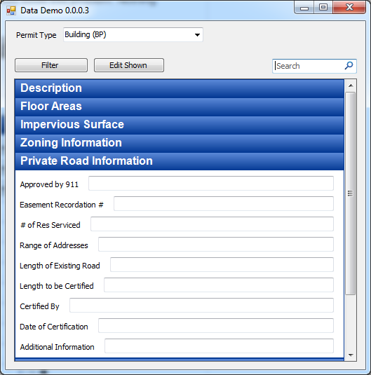
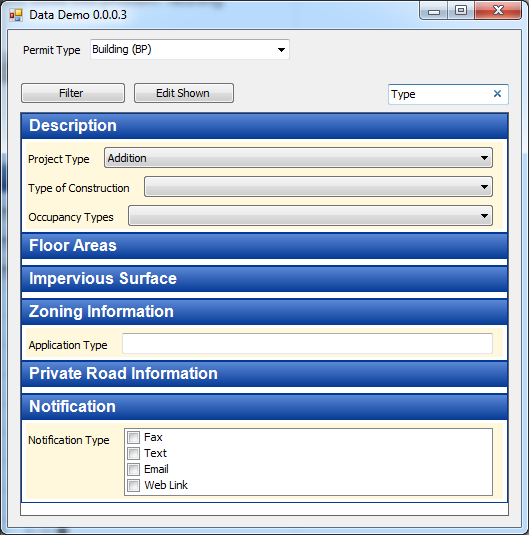
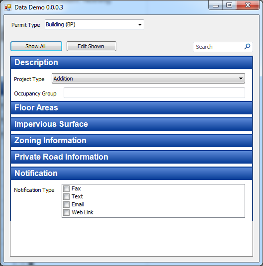
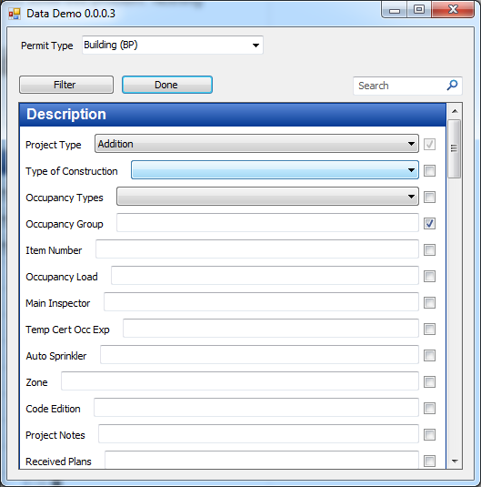

DSDDemo
=======

Trying on a UX hat.

As I was observing some users using an existing system I noticed that there were several screens with several tabs. The users had difficulty remembering which tab had the field they cared about or what the field name even was.

This demo was created as a challenge to myself as to how one could solve this problem. Nothing fancy. 

I grouped each field like it was in the existing application tabs. Those sections can expand and contract if you click on them. 

You can also use the search box at the top to filter the visible fields. 

If there are only a few fields you care about you can click the Filter button which will then change to show all. 

Clicking on Edit Shown will put a checkbox near every field. Required fields have the checkbox disabled. Clicking Done exits edit mode.

The fields that are checked are the ones that show when you filter.